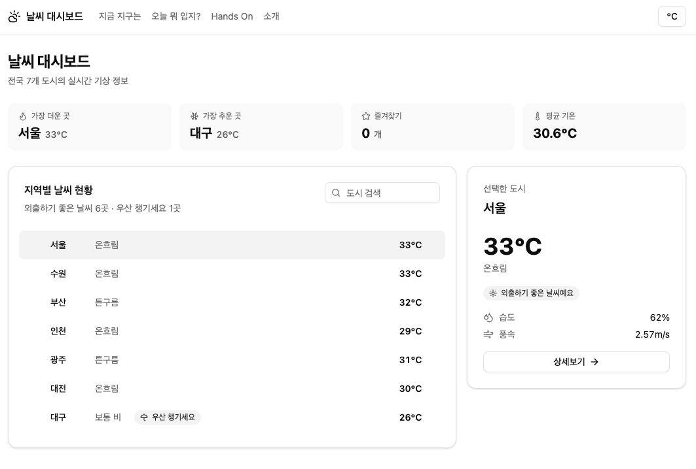
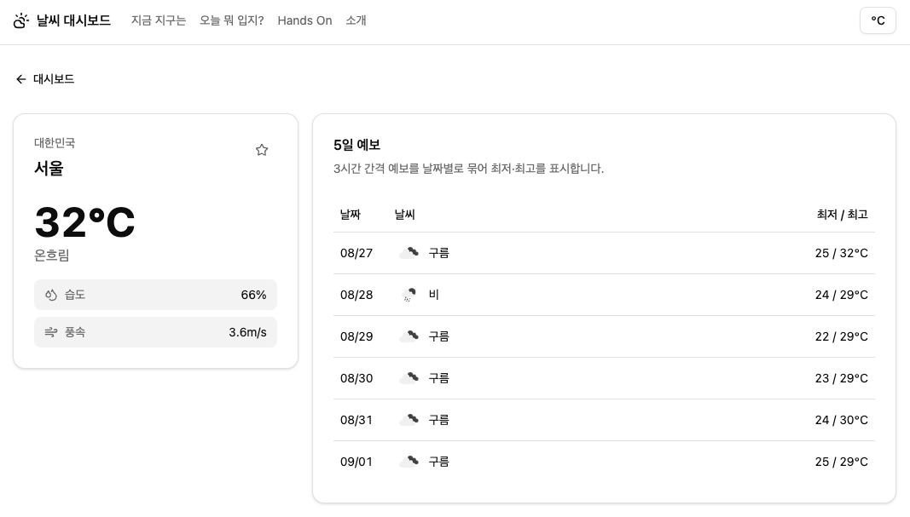
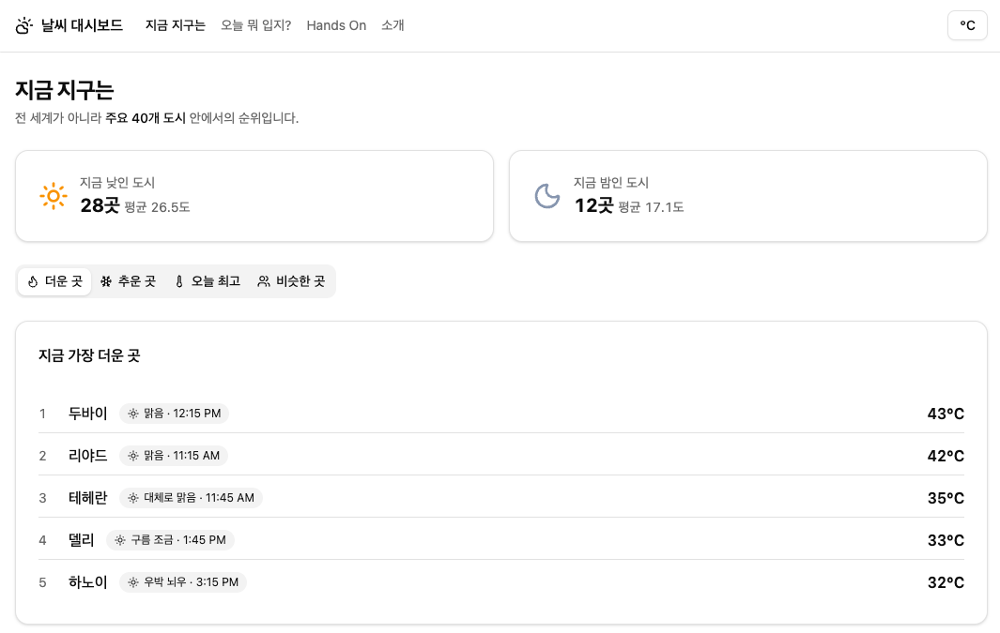

# 날씨 대시보드

- 목적
  - 국내 7개 도시의 실시간 날씨와 5일 예보
  - 세계 40개 도시 기온 비교
- 사용 기술
  - Vue 3 · Pinia · Axios · Tailwind CSS · shadcn-vue

## 링크

- 배포 — https://skala-weather-dashboard.vercel.app
- 저장소 — https://github.com/minkyojung/skala-weather-dashboard
- 배포본은 별도 설정 없이 바로 확인할 수 있습니다.

## 로컬에서 실행하려면

- 사전 조건
  - 외부 API를 2개 사용
    - OpenWeatherMap — **API 키 필요.** 국내 날씨, 5일 예보, 옷차림 추천
    - Open-Meteo — 키 불필요. 세계 40개 도시 비교(`/world`)
  - 키를 등록하지 않으면 `/world`만 동작하고 나머지 화면은 오류 메시지가 표시
  - 저장소에는 키가 포함되지 않으므로, 소스로 직접 실행하려면 본인 키가 필요합니다.
- 1단계 · 키 발급
  - [openweathermap.org/api](https://openweathermap.org/api)에서 발급
  - 활성화까지 최대 2시간이 걸립니다. 그 전에는 `401`이 뜹니다.
- 2단계 · 환경변수 설정
  - 프로젝트 루트에 `.env.local` 생성
  - `VITE_OWM_API_KEY=발급받은_키`
  - `.env.local`은 git에 올라가지 않습니다. `.env.example`을 참고하세요.
- 3단계 · 실행
  - `npm install`
  - `npm run dev`
  - [http://localhost:5180](http://localhost:5180) 접속
  - `.env.local`을 수정했다면 dev 서버를 재시작해야 반영됩니다.
- 배포 설정 (Vercel)
  - Settings → Environment Variables에 `VITE_OWM_API_KEY` 등록
  - 등록하지 않으면 배포본에서도 `/world`만 동작합니다.
  - 변수를 추가·변경한 뒤에는 재배포해야 반영됩니다.
  - `vercel.json`에 SPA rewrite 설정 — 없으면 `/world` 직접 접속 시 404

## 화면

- `/` 대시보드
  - 국내 7개 도시의 현재 기온을 한 목록으로 표시
  - 상단에 가장 더운 곳 / 추운 곳 / 즐겨찾기 수 / 평균 기온
  - 도시를 선택하면 우측 패널에 습도·풍속과 함께 상세 정보
  - 도시 이름 검색, 즐겨찾기 등록
- `/weather/:cityId` 상세
  - 선택한 도시의 현재 날씨와 5일 예보
- `/world` 지금 지구는
  - 세계 40개 도시를 요청 한 번으로 받아 순위 비교
  - 탭 4개 — 더운 곳 / 추운 곳 / 오늘 최고 / 비슷한 곳
- `/advice` 오늘 뭐 입지?
  - 날씨를 해석해 준비물(우산·겉옷)이 같은 도시끼리 묶어서 표시
- `/stack` Hands On
  - 수업 중 수행한 날씨 실습(1~3일차)과 Pinia 카운터
- `/about` 소개
  - 사용한 기술과 구현 방식 요약
- 온도 단위(℃ / ℉)는 헤더 버튼으로 전환하며, 모든 화면에 즉시 반영

### 화면 미리보기

**대시보드** — 국내 7개 도시, 즐겨찾기, 선택 도시 상세

**상세** — 현재 날씨와 5일 예보

**지금 지구는** — 세계 40개 도시 순위

## 구현 내용

- UI · shadcn-vue
  - Tailwind CSS v4 + shadcn-vue(new-york, neutral) 조합
  - 사용한 컴포넌트 — Card, Button, Badge, Select, Tabs, Table, Input, Skeleton, Separator
  - 아이콘은 Lucide, 날씨 아이콘만 OpenWeatherMap 이미지 사용
  - shadcn은 npm 패키지가 아니라 소스를 `src/components/ui/`로 복사하는 방식
  - 따라서 이 폴더는 CLI가 생성한 코드이며 직접 작성하지 않음
- 상태 관리 · Pinia
  - `configStore` — 온도 단위(`unit`), 기호(`unitSymbol`), 토글(`toggleUnit`)
  - `favoriteStore` — 즐겨찾기 목록, 개수, `isFavorite(id)`, `toggleFavorite(id)`
  - `counter` — 실습용 카운터
  - `useTemperature` 컴포저블이 섭씨→화씨 변환을 전담
  - 5개 파일에 같은 변환식이 중복되어 한 곳으로 모음
- 데이터 · 외부 API 2곳
  - OpenWeatherMap
    - Current Weather — 국내 7개 도시 현재 날씨
    - 5 Day Forecast — 3시간 간격 40개를 날짜별로 묶어 최저·최고로 요약
    - 도시 7개는 `Promise.all`로 병렬 요청. 순차로 보내면 7배 느림
  - Open-Meteo (키 불필요)
    - 좌표를 콤마로 이어 붙이면 40개 도시를 요청 한 번으로 수신
    - 현재 기온과 오늘 최고기온을 함께 받아 두 가지 순위를 생성
  - 두 API의 날씨 표현이 다름
    - OpenWeatherMap은 `"Rain"` 문자열, Open-Meteo는 WMO 숫자 코드(`61`)
    - 각각 한글로 변환해 사용

## 설계하며 판단한 것

- 온도 변환은 표시할 때만 한다
  - 원본 데이터는 항상 섭씨로 받고, 화씨 변환은 화면에서만 수행
  - 단위를 바꿀 때마다 API를 다시 부르면 호출 한도만 소모
  - 더움/선선함 판단은 섭씨 원본(`city.temp`)으로 유지
  - 변환값(82℉)으로 25도 기준을 비교하면 모든 도시가 '더움'이 됨
- 세계 순위는 지금 밤인 도시가 유리하다
  - 조회 시점 기온으로 줄을 세우면 밤인 도시 평균이 낮인 도시보다 약 6도 낮게 측정
  - 기후 차이가 아니라 시차 때문
  - 예) 나이로비는 적도 도시지만 현지 새벽에 조회하면 '가장 추운 곳'에 오름
  - 대응 — 각 도시에 현지 시각과 낮/밤을 함께 표시해 편향을 드러냄
  - 대응 — 조회 시각과 무관한 '오늘 최고기온' 탭을 따로 제공
- 목록에서 모든 행이 같은 값이면 정보가 아니다
  - 7개 도시에 동일한 추천 뱃지를 반복하면 잡음만 증가
  - 공통 추천은 카드 설명에 한 줄로 요약
  - 다수와 다른 추천을 가진 도시에만 뱃지를 표시
- 순위 항목은 라벨이 질문, 값이 답이다
  - '가장 더운 곳'의 답은 온도가 아니라 도시 이름
  - 도시 이름을 크게, 온도를 보조 정보로 배치
- 경고색은 실제 경고에만 쓴다
  - 초기에는 25도 이상을 `destructive`(빨강) 뱃지로 표시
  - 여름철에는 모든 도시가 빨강이 되어 강조 의미가 사라짐
  - 온도 숫자가 이미 같은 정보를 전달하므로 뱃지 자체를 제거
- shadcn은 UI 조각만 제공한다
  - Card, Button 같은 프리미티브는 날씨를 모름
  - `WeatherRow`, `RankingList` 같은 도메인 컴포넌트는 직접 조립
  - 기존 컴포넌트를 교체하지 않고 내부를 프리미티브로 채우는 방식으로 이관
- 3일차 실습 산출물은 그대로 둔다
  - `WeatherCard`, `BaseDashboardCard`, `SearchBar`는 `WeatherParent.vue`가 사용
  - 새 대시보드는 `WeatherRow`를 사용하고, 실습 파일은 당시 형태를 유지

## 직접 작성·수정한 파일

- 신규 작성
  - `src/stores/` — `configStore.js`, `favoriteStore.js`, `counter.js`
  - `src/composables/useTemperature.js`
  - `src/api/` — `weatherApi.js`, `worldWeatherApi.js`
  - `src/constants/` — `cities.js`, `worldCities.js`
  - `src/components/exercise/` — `UnitToggler.vue`, `ForecastList.vue`, `RankingList.vue`, `StatCard.vue`, `WeatherRow.vue`
  - `src/components/practices/library/StoreCounter.vue`
  - `src/views/WorldWeatherView.vue`
- 수정
  - `src/main.js` — Pinia 등록
  - `src/App.vue` — 앱 셸(헤더·네비게이션) 재구성
  - `src/router/index.js` — `/world` 경로 추가
  - `src/views/` — `WeatherHomeView`, `WeatherDetailView`, `WeatherAdviceView`, `WeatherAboutView`, `PracticeStackView`, `NotFoundView`
  - `src/components/exercise/` — `WeatherCard.vue`, `AdviceBadge.vue`
  - `src/utils/weatherAdvice.js` — 아이콘 매핑용 `type` 키 추가
  - `src/assets/main.css`, `vite.config.js`, `.gitignore`
- 직접 작성하지 않음
  - `src/components/ui/` — shadcn-vue CLI가 생성 (36개 파일)
  - `src/lib/utils.js` — shadcn-vue CLI가 생성
  - `components.json` — shadcn-vue 설정 파일
- 이전 수업 실습 파일
  - `src/weather.vue`, `src/weather-2.vue`, `src/WeatherParent.vue` — 1~3일차 날씨 실습
  - `src/components/exercise/BaseDashboardCard.vue`, `SearchBar.vue` — 3일차 실습에서 사용
  - 위 파일들은 당시 형태를 유지하기 위해 최소한만 수정

## AI 사용

- 사용 도구
  - Claude Code
- 사용 범위
  - Pinia 스토어, API 호출 모듈, 컴포저블, 컴포넌트 작성
  - 외부 API 후보 조사 및 응답 형식 검증
  - Tailwind CSS·shadcn-vue 도입과 기존 화면 이관
  - README 초안 작성
- 직접 확인하고 수정한 내용
  - 외부 API 주제를 직접 탐색하고, 구현 난이도를 따져 과제 범위에 맞게 조정
  - 추가 Store를 즐겨찾기로 선택 — 인자를 받는 getter를 다뤄보기 위해
  - 생성된 UI가 정보 위계 없이 나열만 한다고 판단해 레이아웃 재설계를 요구
  - 시간 표기를 24시간제에서 AM/PM으로 수정
  - dev 서버 실행 오류를 발견해 원인을 확인하고 포트 설정을 분리
  - 코드 챌린지와 Hands On을 구분해 제출 범위를 결정
  - README 구조와 문체를 직접 재작성
